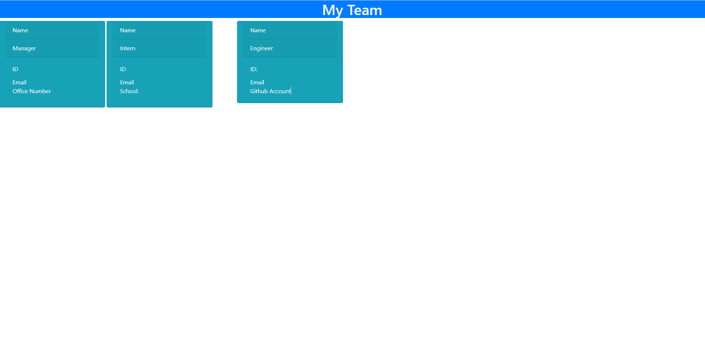

# Team-Profile-Generator

## Description
- The purpose of this assignment was to create, from scratch, a command line application that could take in user input and dynamically generate an HTML file to create a team consisting of a team manager, engineers and interns. Utilizing node.js and npm packages such as inquirer, jest and fs to take in user input to dynamically generate the HTML. We were also to utilize test driven development with the NPM Jest package, and utilize classes and subclasses as well. 

## Installation
in command line, ensure the dependencies are installed:
-NPM I
-NPM I Jest
-NPM I Inquirer
-NPM I fs

## To run the app make sure you're in the directory and type into the command line:
-node index.js

## To run the test suite type into the command line:
-npm run test

## Technologies used
- Javascript
- Node
- NPM Inquirer
- NPM Jest
- NPM FS
- HTML
- Bootstrap CSS

## Screenshot

## Challenges
I was unable to complete this assignment fully in the allotted time, however I am going to go back to it to shore up the parts I missed, as I believe this is an important skill to learn upon.
- My inquirer prompts didn't pass my choice data to split the decision tree
- I was unable to figure out how to insert and append the template html with the template literal data taken in by user input to dynamically generate the cards in the html.
- Setting up the tests first is an interesting way of approaching this, however I found myself backtracking to change the tests in order to make them work, I also had some issues getting the constructors to inherit the properties of the super constructior although I did manage to figure that out.

## Questions:
 https://github.com/MarkAndersen

[Email me:](mailto:Mark.Andersen75@gmail.com)